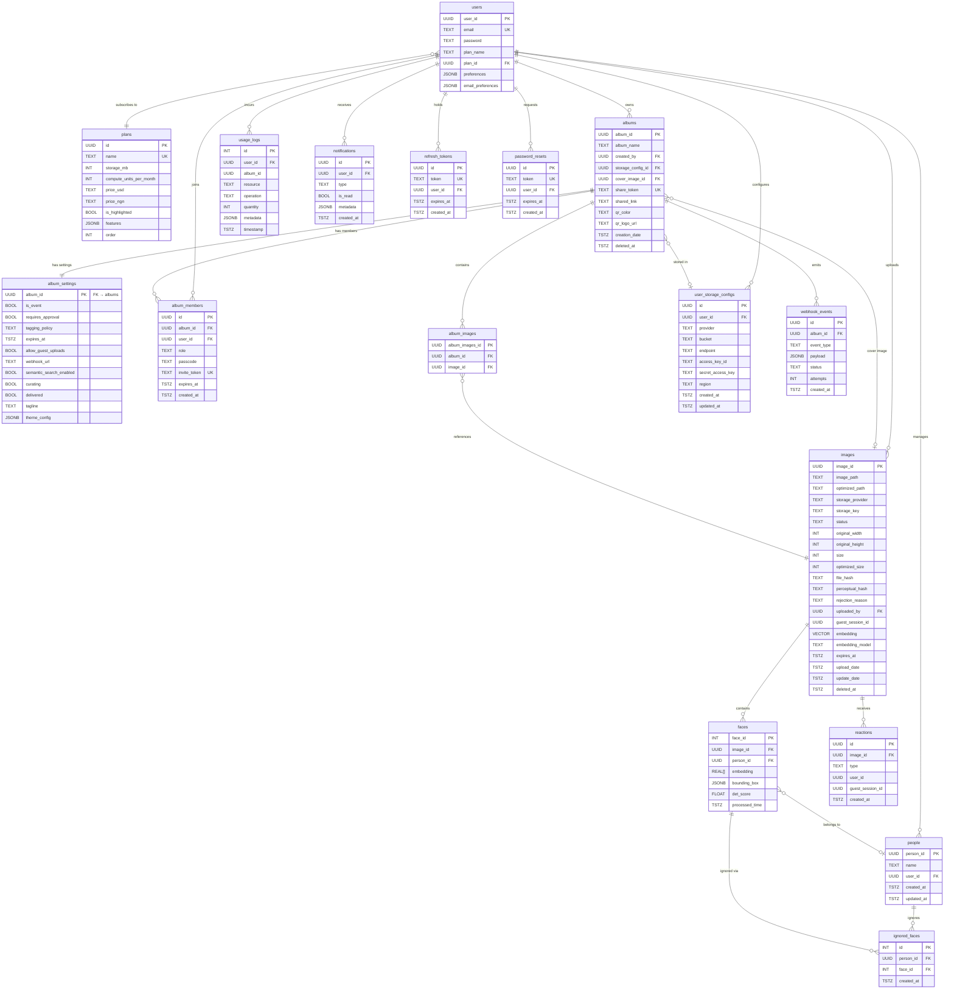

# Entity Relationship Diagram

## Notes

- `tagging_policy` — `HOST_ONLY` | `GUESTS_SELF` | `ANYONE`
- `album_members.role` — `VIEWER` | `CONTRIBUTOR` | `ADMIN`
- `images.status` — `PENDING` | `APPROVED` | `REJECTED`
- `images.embedding` — `vector(512)` (pgvector); model tracked in `embedding_model`
- `faces.embedding` — `REAL[]` (InsightFace 512-dim ArcFace)
- `album_settings.theme_config` — `JSONB` storing `ThemeConfig` (accent, font, heroLayout, gridStyle, cornerRadius, backgroundTexture, branding, heroMode, heroSlideshow, etc.)
- `album_settings.tagging_policy` defaults to `HOST_ONLY`
- `images.expires_at` — free-tier 14-day TTL; `NULL` on paid plans
- `webhook_events.status` — `PENDING` | `SUCCESS` | `FAILED`
